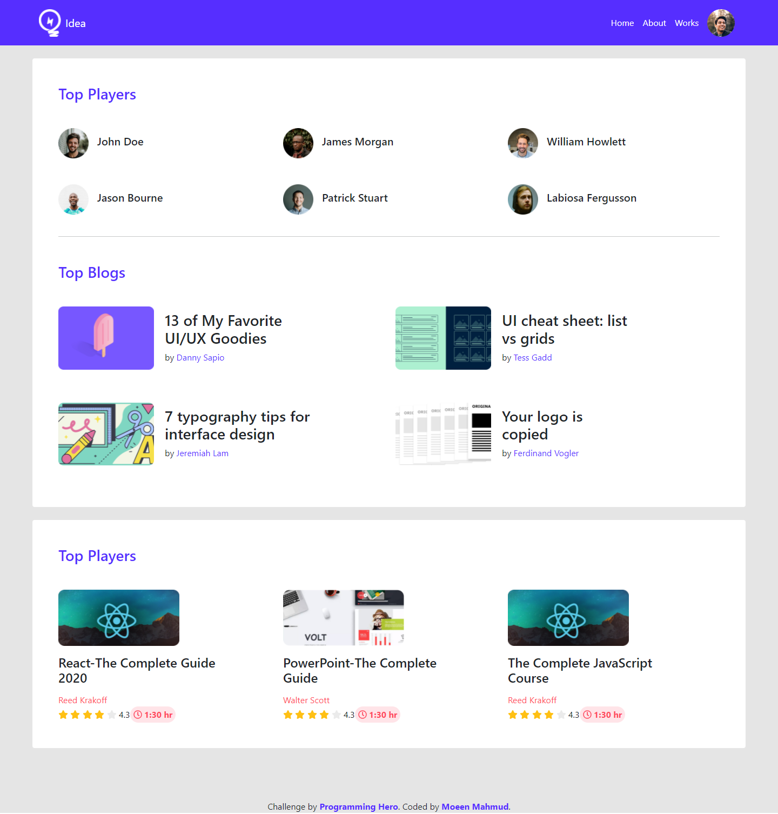

# Programming Hero - Leader Board Landing Page Solution

This is a solution to the [Leader Board Landing Page challenge on Programming Hero](https://github.com/ProgrammingHero1/leader-board). Programming Hero is a great frontend web development bootcamp for those who have the passion for learning and coding. It helps you improve your coding skills by buiding realistic projects.

## Table of contents

- [Overview](#overview)
  - [The challenge](#the-challenge)
  - [Screenshot](#screenshot)
  - [Links](#links)
- [My process](#my-process)
  - [Built with](#built-with)
  - [What I learned](#what-i-learned)
  - [Continued development](#continued-development)
  - [Useful resources](#useful-resources)
- [Author](#author)

## Overview

### The challenge

Users should be able to view the optimal layout depending on their device's screen size

### Screenshot

### Links

- Solution URL: [Git Repo](https://github.com/moeen-mahmud/leader-board-bootstrap)
- Live Site URL: [Live Site](https://leader-board-bootstrap.vercel.app/)

## My Process

### Built With

- HTML5 markup
- Custom CSS
- Bootstrap
- Mobile-first workflow

### What I learned

This is the follow up project of previouse [Leader Board Challenge](https://exercise-leader-board.vercel.app/). It's just the bootstrap version. I follow the [Bootstrap Documentation](https://getbootstrap.com/docs/5.0/getting-started/introduction/) for building this page.

### Continued Development

By doing this project, I came to realize that, raw css is far better than bootstrap as always.

### Useful resources

- [Bootstrap Documentation](https://getbootstrap.com/docs/5.0/getting-started/introduction/)
- [Mozilla Developer Network](https://developer.mozilla.org/en-US/)

## Author

- Facebook - [moeen.mahmud](https://www.facebook.com/moeen.mahmud)
- Twitter - [moeen_mahmud](https://twitter.com/moeen_mahmud)
